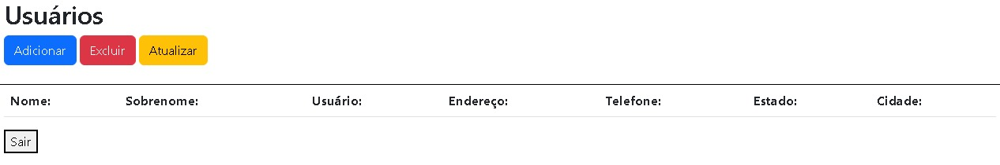

# Formulario_Faculdade

# Indice
- [Sobre](#-Sobre)
- [Integrantes](#-Integrantes)
- [Modelo 1 - Login](#-Modelo-1---Login)
- [Modelo 2 - Cadastro](#-Modelo-2---Cadastro)
- [Modelo 3 - Atualização](#-Modelo-3---Atualização)
- [Modelo 4 - Logado](#-Modelo-4---Logado)

## Sobre

Formulario para projeto da Faculdade da aula do professor Raphael com telas de cadastro, login, atualização e Exclusão.

## Integrantes

Matheus Perez Da Silva - 07154547

Vitor Borges Vieira - 07149263

Leonardo Dias Vieira - 07157381

Tiago Bezerra Dos Santos - 07152838

Mateus Bastos de Oliveira

Lucas Pandolpho Cavalcante

<a href="https://github.com/vitorborqge/Formulario_Faculdade">Acesse por meio deste link</a>

## 📩 Modelo 1 - Login

<h3 align="center">
  <a href="https://github.com/vitorborqge/Formulario_Faculdade">Acessar demonstração</a>
</h3>

## 📩 Modelo 2 - Cadastro

<h3 align="center">
  <a href="https://github.com/vitorborqge/Formulario_Faculdade">Acessar demonstração</a>
</h3>

## 📩 Modelo 3 - Atualização

<h3 align="center">
  <a href="https://github.com/vitorborqge/Formulario_Faculdade">Acessar demonstração</a>
</h3>

## 📩 Modelo 4 - Logado

<h3 align="center">
  <a href="https://github.com/vitorborqge/Formulario_Faculdade">Acessar demonstração</a>
</h3>

    

🚀 Tecnologias utilizadas

✔️ HTML5 
  

✔️ CSS3 

✔️ JS 
  

  
  Feito por Vitorborqge
